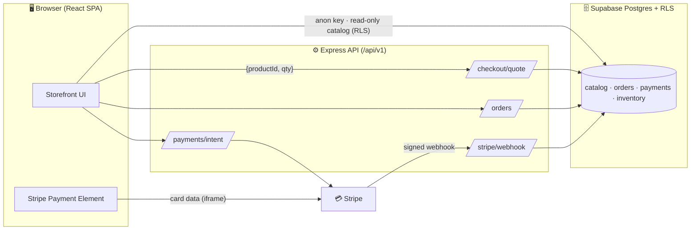

<div align="center">


# ✨ Meyaar Jewellers

### Handcrafted Pakistani-inspired artisan luxury jewelry — a secure, high-converting e-commerce platform.

[](#)
[](LICENSE)
[](#)
[](#)
[](#)
[](#)
[](#)
[](#)

[**🌐 Live Demo**](#) · [**📖 Docs**](docs/) · [**🛠️ Audit & Roadmap**](docs/audit/) · [**🐛 Report a Bug**](../../issues)


</div>

---

## 📑 Table of Contents

- [About](#-about)
- [Features](#-features)
- [Screenshots](#-screenshots)
- [Tech Stack](#-tech-stack)
- [Architecture](#-architecture)
- [Quick Start](#-quick-start)
- [Environment Variables](#-environment-variables)
- [Project Structure](#-project-structure)
- [Available Scripts](#-available-scripts)
- [Security](#-security)
- [Deployment](#-deployment)
- [Roadmap](#-roadmap)
- [Contributing](#-contributing)
- [License](#-license)

---

## 💎 About

**Meyaar Jewellers** is a modern storefront for a handmade, limited-edition jewelry brand. It pairs an editorial, luxury shopping experience with a hardened, server-authoritative commerce backend: every price, discount, tax, and payment is computed and verified on the server, card data never touches our infrastructure, and inventory stays truthful through an atomic order → payment → fulfillment pipeline.

> Built for trust. Designed to convert. Engineered to scale.

<details>
<summary><b>Who is this for?</b></summary>

- **Shoppers** — browse curated necklaces, bracelets, and earrings with rich detail (material, purity, gemstone, certification, care), secure one-tap checkout, and order tracking.
- **The business** — manage catalog, inventory, orders, refunds, and promotions from a role-protected admin.
- **Developers** — a clean, typed, well-documented React + Express + Supabase codebase with tests and CI.

</details>

---

## 🚀 Features

<table>
<tr>
<td width="50%" valign="top">

### 🛍️ Storefront
- Editorial homepage with featured collections
- Category & collection pages with **faceted filters + sort**
- Product detail with **variants** (size / length / metal), zoom gallery, specs & certification
- **Search** across name, material, and gemstone
- Real **reviews & ratings** with verified-purchase badges
- **Wishlist** & save-for-later
- Trust signals: secure-checkout, free returns, handmade provenance

</td>
<td width="50%" valign="top">

### 🔐 Commerce & Checkout
- **Server-authoritative pricing** — totals computed from the DB, never the browser
- **Stripe Payment Element** — cards + **Apple Pay / Google Pay**
- **PCI SAQ A** — card data stays in Stripe's iframe
- Validated coupon codes, Stripe Tax, configurable shipping
- **Atomic** order → payment → inventory via signed webhooks
- Guest & authenticated checkout
- Transactional order-confirmation emails

</td>
</tr>
<tr>
<td width="50%" valign="top">

### 📈 Growth
- **SEO**: per-page metadata, JSON-LD (Product / Organization / Breadcrumb), sitemap & robots
- **GA4** ecommerce funnel + conversion tracking
- Email capture with welcome flow
- Abandoned-cart recovery
- Upsell / cross-sell ("complete the set")

</td>
<td width="50%" valign="top">

### 🛡️ Platform
- **Row-Level Security** on every table
- Rate limiting, helmet, CSP, Zod validation
- Structured logging (pino) + Sentry + uptime monitoring
- **CI/CD** with typecheck, lint, tests, secret scanning
- Automated backups + documented DR
- Stateless, horizontally scalable

</td>
</tr>
</table>

---

## 🖼️ Screenshots

<div align="center">

| Home | Product | Checkout |
|:---:|:---:|:---:|
|  |  |  |

</div>

---

## 🧰 Tech Stack

| Layer | Technology |
|-------|-----------|
| **Frontend** | React 18, TypeScript, Vite, Tailwind CSS, shadcn/ui (Radix), Framer Motion, wouter, TanStack Query |
| **Backend** | Node.js, Express, Zod, Drizzle ORM |
| **Database & Auth** | Supabase (PostgreSQL + Auth + Storage), Row-Level Security |
| **Payments** | Stripe (PaymentIntents, Payment Element, Stripe Tax, Webhooks) |
| **Email** | Transactional provider (Resend / SES / Postmark) |
| **Observability** | pino, Sentry, uptime monitoring |
| **Tooling** | ESLint, Prettier, Vitest, Playwright, gitleaks, GitHub Actions |

---

## 🏛️ Architecture



**Core principle:** the browser is never trusted for price, stock, or authorization. Catalog reads are fast and client-side under RLS; **all money and all writes go through the server.** Full design in [`.claude/specs/production-readiness/design.md`](.claude/specs/production-readiness/design.md).

---

## ⚡ Quick Start

> **Prerequisites:** Node.js 20+, npm, a Supabase project, and a Stripe account.

```bash
# 1. Clone
git clone https://github.com/<your-org>/meyaar-jewellers.git
cd meyaar-jewellers

# 2. Install
npm install

# 3. Configure environment (see below)
cp .env.server.example .env.server
cp frontend/.env.example frontend/.env
#   …fill in your keys

# 4. Apply database schema + RLS
npm run db:push

# 5. Run (backend + frontend on one port)
npm run dev
#   → http://localhost:3000
```

---

## 🔑 Environment Variables

Secrets are split so that **nothing sensitive is ever shipped to the browser**. Any `VITE_`-prefixed variable is public.

<details>
<summary><b><code>.env.server</code> — server only (never <code>VITE_</code>)</b></summary>

```ini
STRIPE_SECRET_KEY=sk_live_xxx
STRIPE_WEBHOOK_SECRET=whsec_xxx
SUPABASE_SERVICE_ROLE_KEY=xxx          # bypasses RLS — server only
GMAIL_APP_PASSWORD=xxx                  # or RESEND_API_KEY
SHIPPING_FLAT_RATE_CENTS=900            # configurable
SHIPPING_FREE_THRESHOLD_CENTS=10000     # free over this subtotal
```
</details>

<details>
<summary><b><code>frontend/.env</code> — browser-safe public values only</b></summary>

```ini
VITE_SUPABASE_URL=https://xxxx.supabase.co
VITE_SUPABASE_ANON_KEY=xxx              # safe: limited by RLS
VITE_STRIPE_PUBLISHABLE_KEY=pk_live_xxx
```
</details>

> 🔒 The server refuses to boot if a required secret is missing or if a secret-looking value is `VITE_`-prefixed. See [Security](#-security).

---

## 📁 Project Structure

```
meyaar-jewellers/
├── frontend/                 # React + Vite SPA
│   └── src/
│       ├── components/       # UI (home, product, checkout, ui/…)
│       ├── pages/            # Routes (Home, Category, ProductDetail, Checkout…)
│       ├── contexts/         # Auth, Cart
│       ├── lib/              # supabase client, services, query client
│       └── hooks/
├── backend/                  # Express API (/api/v1)
│   ├── routes/               # checkout, orders, payments, webhook, health
│   ├── services/             # pricing, coupons, inventory, stripe, fulfillment
│   ├── middleware/           # helmet, cors, rate-limit, validation
│   ├── migrations/           # Drizzle migrations + RLS policies
│   └── config/               # env validation
├── shared/                   # Drizzle schema + shared types
├── e2e/                      # Playwright tests
├── docs/                     # Guides + full audit & roadmap
└── .claude/specs/            # Specs, design, task breakdowns
```

---

## 📜 Available Scripts

| Script | Description |
|--------|-------------|
| `npm run dev` | Run backend + frontend (single port, HMR) |
| `npm run build` | Production build (client + server bundle) |
| `npm run start` | Run the production build |
| `npm run check` | TypeScript typecheck |
| `npm run db:push` | Apply Drizzle schema to the database |
| `npm test` | Unit + integration tests (Vitest) |
| `npm run test:e2e` | End-to-end tests (Playwright) |
| `npm run lint` | ESLint |

---

## 🛡️ Security

Meyaar Jewellers is built security-first:

- ✅ **PCI-DSS SAQ A** — card data is collected by Stripe Elements and never reaches our servers
- ✅ **Server-authoritative pricing** — clients cannot alter prices, discounts, or charge amounts
- ✅ **Row-Level Security** on every Supabase table
- ✅ **Webhook signature verification** + idempotency keys (no double-charges, payment is source of truth)
- ✅ **Secret hygiene** — split client/server env, history scrubbed, `gitleaks` pre-commit, boot-time validation
- ✅ **Hardened API** — helmet, strict CORS, CSP, rate limiting, Zod validation, JWT verification
- ✅ **Monitoring** — Sentry + structured logs + uptime alerts

Found a vulnerability? Please **do not** open a public issue — email `security@meyaarjewellers.com`.

---

## ☁️ Deployment

<details>
<summary><b>Recommended: Managed PaaS</b></summary>

- **Frontend / SSR** → Vercel or Netlify
- **Database / Auth / Storage** → Supabase (RLS + PITR backups)
- **CDN / WAF** → Cloudflare
- **Payments** → Stripe (live mode after verification)
- **Email** → Resend / Postmark
- **CI/CD** → GitHub Actions (`typecheck → lint → test → build → deploy`)

```bash
npm run build      # produces dist/
npm run start      # serves the production build
```
</details>

---

## 🗺️ Roadmap

| Phase | Focus | Status |
|-------|-------|:------:|
| **P1** | Security & payment foundation (server pricing, Stripe Element, RLS, atomic orders) | 🟢 |
| **P2** | Reliability (authz, validation, email, admin, monitoring, CI/CD) | 🟢 |
| **P3** | Performance & scalability (images, CDN, caching) | 🟢 |
| **P4** | SEO (SSR, structured data, sitemap) | 🟢 |
| **P5** | Conversion optimization (search, reviews, cart recovery, analytics) | 🟢 |
| **P6** | Enhancements (gifting, loyalty, multi-currency) | ⚪ |

Full detail: [`docs/audit/09-MASTER-ROADMAP.md`](docs/audit/09-MASTER-ROADMAP.md).

---

## 🤝 Contributing

1. Fork & branch (`git checkout -b feature/amazing`)
2. Commit (`git commit -m 'feat: add amazing'`)
3. Ensure `npm run check && npm test` pass
4. Open a Pull Request

This project follows Conventional Commits and runs CI on every PR.

---

## 📄 License

Distributed under the **MIT License**. See [`LICENSE`](LICENSE).

---

<div align="center">

**Meyaar Jewellers** — *Handcrafted with love. Engineered with care.*

Made with 💛 in Pakistan

</div>
